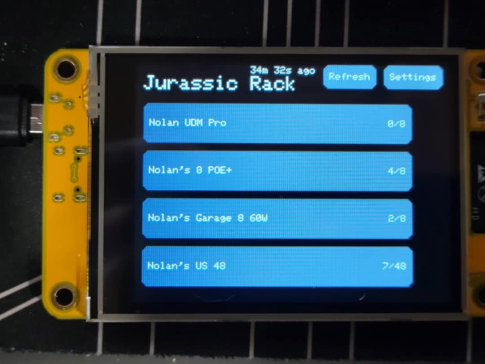
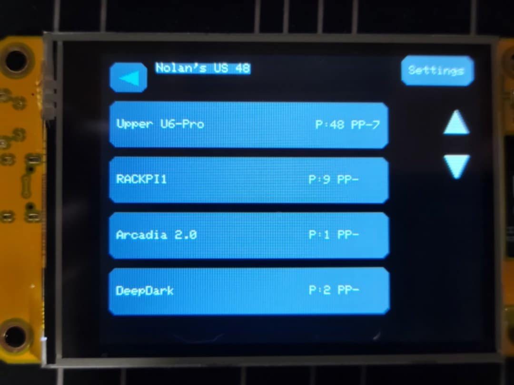

@ -1,2 +1,105 @@
# CYD ESP UniFi Touchscreen Network Mapper

> **Touchscreen UniFi Network Port Mapper for CYD ESP32** – Instantly see which switch port and patch panel a UniFi client is connected to, right from a handheld touchscreen.

 <!-- Replace with actual photo path if available -->

---

## 📖 Overview

This Arduino-based project turns a **CYD ESP32 touchscreen** into a live UniFi network mapping tool. It connects to the UniFi Controller API and displays:

- **Client connection details** – which switch port each client is plugged into  
- **Patch panel mapping** – instantly locate cables  
- **Switch information** – quick access for troubleshooting and network tracing  

Perfect for **IT closets, data centers, and field techs**, this device eliminates the guesswork of tracing cables and speeds up network troubleshooting.

---

## ✨ Features

- Real-time UniFi API integration  
- Touch-friendly UI (CYD ESP32 + TFT_eSPI + XPT2046)  
- Color-coded, easy-to-read interface  
- Simple Wi-Fi and API setup  
- Standalone — no PC required

---

## ⚙️ User Configuration

Before compiling, update these values in the `.ino` file:

```cpp
// ——— USER CONFIGURATION —————————————
const char* rackName = "Rack Number";    // Friendly name for display
const uint8_t UI_ROTATION = 1;           // 1 = USB right, 3 = USB left
const char* ssid = "WIFINAME";           // Wi-Fi SSID
const char* password = "WIFIPASS";       // Wi-Fi password
const char* apiKey = "APIKEY";           // UniFi API key
const char* host = "192.168.2.1";        // UniFi Gateway IP
const char* siteId = "default";          // UniFi site ID
```

> ⚠️ **Security note:** Keep your API key private. If sharing code publicly, remove or replace it with a placeholder.

---

## 🎨 Changing Theme Colors

Theme colors are defined near the top of the `.ino` file:

```cpp
// ─── THEME COLORS ─────────────────────────────────────────────────────────────
static constexpr uint16_t COLOR_BG = 0x1082;      // Background color
static constexpr uint16_t COLOR_PANEL = 0x530D;   // Panel/Card background
static constexpr uint16_t COLOR_ACCENT = 0x05FA;  // Accent color
```

To change them:
1. Use a [color picker](https://rgbcolorpicker.com/565) to find the desired 16-bit **RGB565** color value.  
2. Replace the hex values (`0xXXXX`) with your chosen colors.  
3. Recompile and upload to your CYD ESP32.

---

## 🔑 Getting Your UniFi API Key & Site ID

### **UniFi API Key**
1. Log in to your UniFi Network Controller (Web UI).  
2. Click your **profile icon → API Keys** (may be under Settings → System → Advanced).  
3. Create a new API key with **read-only** access (for security).  
4. Copy this key into the `apiKey` field in the `.ino` file.

### **Site ID**
1. From the UniFi Network Controller dashboard, select your site.  
2. Look at the URL — it will look like:  
   ```
   https://<controller-ip>:8443/manage/site/abcd1234/dashboard
   ```
3. The `abcd1234` part is your **site ID** (in older controllers, it may be `default`).  
4. Enter this into the `siteId` variable in the `.ino` file.

---

## 🛠 Hardware Requirements

- CYD ESP32 with built-in touchscreen  
- TFT_eSPI display driver  
- XPT2046 touch controller  
- Access to a UniFi Controller with API key

---

## 📦 Required Libraries

Install via Arduino IDE Library Manager:

- `TFT_eSPI`
- `XPT2046_Touchscreen`
- `ArduinoJson`
- `WiFi`
- `WiFiClientSecure`
- `HTTPClient`

---

## 🚀 How It Works

1. On startup, the device connects to your Wi-Fi and UniFi Controller.  
2. The touchscreen displays connected clients and their switch port.  
3. Tap through the interface to view switch details and patch panel mapping.  

---

## 📸 Screenshots

| Home Screen | Client Details | Patch Panel Mapping |
|-------------|----------------|---------------------|
|  |  |  |

---

## 📄 License

This project is licensed under the MIT License — see the [LICENSE](LICENSE) file for details.

---

## 🤝 Contributing

Contributions, issues, and feature requests are welcome!  
Feel free to check [issues page](../../issues) if you want to contribute.

---

## ⭐ Acknowledgements

- Built with Arduino IDE  
- Uses UniFi Controller API  
- UI powered by TFT_eSPI and XPT2046  
